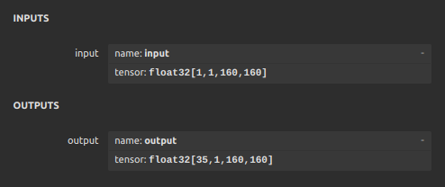

# Fast Gesture (Preview Release)

## 1. Introduce

Hand keypoint recognition can be considered as an essential technical node in AR/MR human-computer interaction, playing an indispensable role. This project originated from the author's graduation design, which requires keypoint detection on small-sized images. Therefore, a specialized keypoint detection neural network was designed according to actual needs, capable of detecting keypoints and the objects they belong to. The author adopted a classic N-Net network as the backbone network, with different detection heads to accomplish the detection tasks. Keypoint detection tasks are divided into top-down and bottom-up modes, and I adopted a bottom-up design pattern, with one detection head for detecting keypoint coordinates and another for detecting the vector direction of the object to which the keypoint belongs. The final output consists of 35 heatmaps. The complete network architecture is shown below.

<p align="center">

</p>

The following image displays the keypoint recognition results, which were captured from the HMD of the author's graduation project.

*The gesture detection section in the following image uses the `YOLO` project*

<p align="center">

</p>

<p align="center">

</p>

The author utilizes an ONNX model to run on the NVIDIA Jetson Orin Nano 8GB version of the edge computing system, achieving a performance of up to 30 frames per second.

The accuracy depicted in the above figure is influenced by the quality of self-annotated and synthetic datasets, which does not meet expectations and still has room for improvement.


## 2. Environment Requirements

It is recommended to install `torch 2.2.1` for faster training speed. Use the following command:
```
pip install torch==2.2.1 torchvision==0.17.1 torchaudio==2.2.1 --index-url https://download.pytorch.org/whl/cu118
```

Or install using the default environment configuration file:
```
pip install -r requirements.txt
```

## 3. Scratch on custom data

### *3.1 Label Structure*

- gesture: The gesture index number in the full list of gestures, start from 0;
- hand_type: 0 represents the left hand, 1 represents the right hand;
- id: Hand joint index;
- Bounding box coordinates;

```json
[
  {
    "gesture": 2,  
    "hand_type": 0,
    "points": [
      { "id": 0, "x": 686, "y": 470 },
      { "id": 1, "x": 632, "y": 408 },
      { "id": 2, "x": 612, "y": 341 },
      { "id": 3, "x": 690, "y": 398 },
      { "id": 4, "x": 681, "y": 295 },
      { "id": 5, "x": 722, "y": 398 },
      { "id": 6, "x": 716, "y": 283 },
      { "id": 7, "x": 740, "y": 399 },
      { "id": 8, "x": 724, "y": 297 },
      { "id": 9, "x": 749, "y": 400 },
      { "id": 10, "x": 734, "y": 320 }
    ],
    "bbox": [592, 255, 769, 498]
  },
  {
    "gesture": 0,
    "hand_type": 0,
    "points": [
      { "id": 0, "x": 932, "y": 402 },
      { "id": 1, "x": 850, "y": 332 },
      { "id": 2, "x": 862, "y": 277 },
      { "id": 3, "x": 844, "y": 292 },
      { "id": 4, "x": 812, "y": 188 },
      { "id": 5, "x": 875, "y": 278 },
      { "id": 6, "x": 875, "y": 266 },
      { "id": 7, "x": 908, "y": 276 },
      { "id": 8, "x": 905, "y": 271 },
      { "id": 9, "x": 939, "y": 282 },
      { "id": 10, "x": 932, "y": 279 }
    ],
    "bbox": [793, 156, 958, 434]
  }
]
```
In the example provided, we can know that there are two hands in a single picture. The parameters "gesture" and "hand_type" are currently irrelevant. There is no assurance that these fields will be updated in future versions.

### *3.2 Make sure your dataset structure as follows：*

```
|-- fg_datasets
|   |-- train
|   |   |-- images
|   |   |-- labels
|   |   |-- datasets_info.json
|   |
|   |-- val
|   |   |-- images
|   |   |-- labels
```
`datasets_info.json` will be automatically generated the first time you use it.

If you change the value of `img-size`, you must delete the file. Otherwise, the training results will be incorrect.

## 4. Training

The program currently only supports training on a single GPU.
```
python train.py --batch 32 --workers 28 --save_name 20240430 --lr 0.001 --view
```

You can use TensorBoard to visualize the training process.
```
tensorboard --logdir ./run/train  --port=6003 -- bind_all
```

## 5. PNCS (Points Normalization Coefficient)

In the dataset, the two components of the vector from each point to the center point of the object it belongs to are always different. Some points have larger components relative to the center point, reaching 20 to 30 pixels, while others may have components as small as 2 to 3 pixels. In order for the neural network to learn the magnitude of these vector components, it is necessary to normalize all component values to be close to 1. Therefore, the average values of the components of the vectors from each type of keypoint to the center point should be calculated.

***The PNCS parameters will be printed in the console before each training session starts, and this parameter will only appear once, so it needs to be recorded and saved properly.***

## 6. Deployment

You can use the `Fast_Gesture_Test_160x160_fp32.onnx` test program， this is the ONNX model exported by the author.

<p align="center">

</p>

Input Shape: **[batch, channel, img_size, img_size]**

Output Shape: **[maps, batch, img_size, img_size]**, 
- Key Points Heatmap: [:keypoint_cls]  # coordinates 
- ASF Map: [keypoint_cls:]  # Vector information
- - ASF X Map in ASF Map: [0:keypoint_cls]  # The value on the X-axis
- - ASF Y Map in ASF Map: [keypoint_cls:keypoint_cls*2]  # The value on the Y-axis
- - ASF X Minus in ASF Map: [-2]  # Whether the value on the X-axis is negative.
- - ASF Y Minux in ASF Map: [-1]  # Whether the value on the Y-axis is negative.

The contents of the checkpoint file (ckpt):
```
ckpt = torch.load({weight})
model = model_path['model']
pncs = model_path['pncs_result']

model.eval()
```

## 7. Export ONNX

```
python export_onnx.py --weights {/path/weight} --save_path {/path} --save_name {onnx file name}
```

## 8. FAQ

If you have any question, welcome to join my QQ Group: `913211989` ( 小猫不要摸鱼 )

进群令牌：`fromFG`